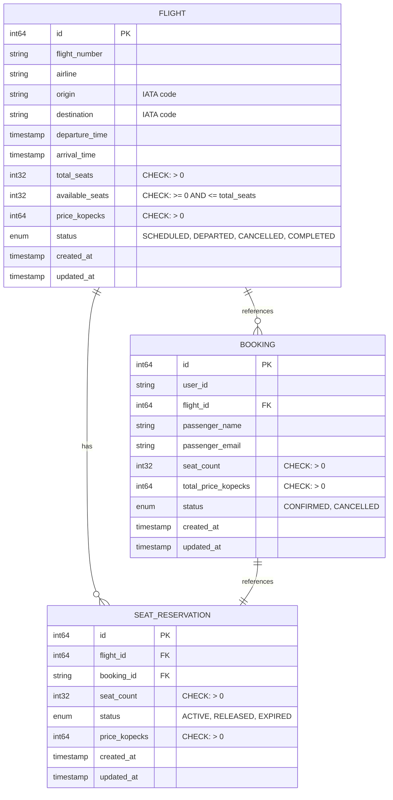

# ER Diagram - Flight Booking System

## Entity-Relationship Diagram (3NF)

## Normalization Analysis

### First Normal Form (1NF)
- All tables have a primary key
- All atomic values (no repeating groups)
- No multi-valued attributes

### Second Normal Form (2NF)
- All non-key attributes are fully dependent on the primary key
- No partial dependencies

### Third Normal Form (3NF)
- No transitive dependencies
- All non-key attributes depend only on the primary key

## Constraints

### Flight Table
- `total_seats > 0` - must have at least one seat
- `available_seats >= 0` - cannot be negative
- `available_seats <= total_seats` - cannot exceed total
- `price_kopecks > 0` - price must be positive
- UNIQUE(flight_number, departure_time) - combination of flight number and date is unique

### SeatReservation Table
- `seat_count > 0` - must reserve at least one seat
- `price_kopecks > 0` - price must be positive
- FOREIGN KEY(flight_id) REFERENCES flight(id)
- UNIQUE(booking_id) - one booking has exactly one reservation

### Booking Table
- `seat_count > 0` - must book at least one seat
- `total_price_kopecks > 0` - total must be positive
- FOREIGN KEY(flight_id) REFERENCES flight(id)

## Indexes

### Flight Table
- PRIMARY KEY on `id`
- UNIQUE INDEX on `(flight_number, departure_time)`
- INDEX on `origin`
- INDEX on `destination`
- INDEX on `status`

### SeatReservation Table
- PRIMARY KEY on `id`
- UNIQUE INDEX on `booking_id`
- INDEX on `flight_id`
- INDEX on `status`

### Booking Table
- PRIMARY KEY on `id`
- INDEX on `user_id`
- INDEX on `flight_id`
- INDEX on `status`
